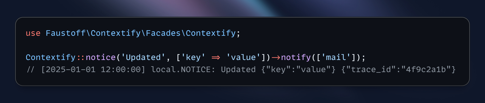

[](https://packagist.org/packages/faustoff/laravel-contextify)
[](https://packagist.org/packages/faustoff/laravel-contextify)
[](https://github.com/faustoff/laravel-contextify/blob/master/LICENSE)
[](https://github.com/faustoff/laravel-contextify)

# Laravel Contextify

> **Contextual logging with inline notifications for Laravel.**



**Laravel Contextify** enhances Laravel's logging with two main features:

1. **Inline Notifications** — [send notifications alongside logging](#sending-notifications) without splitting code into multiple lines for logging and notifying.
2. **Automatic Context Enrichment** — logs and notifications include extra contextual data from configured [Context Providers](#context-providers) (built-in: [Trace ID](src/Context/Providers/TraceIdContextProvider.php), [Process ID](src/Context/Providers/ProcessIdContextProvider.php), [Hostname](src/Context/Providers/HostnameContextProvider.php), [Call file and line](src/Context/Providers/CallContextProvider.php), and more), helping you keep messages short and clean by moving additional context out of the message itself into a separate area.

Provides [`Contextify`](src/Facades/Contextify.php) facade compatible with Laravel's [`Log`](https://laravel.com/docs/12.x/logging#writing-log-messages) facade: same methods (`debug`, `info`, `notice`, `warning`, `error`, `critical`, `alert`, `emergency`) with identical parameters, plus a chainable `notify()` method. 

> **Name origin:** “Contextify” combines **Context** and **Notify**, reflecting its dual purpose — to enrich logs with contextual data and to send notifications for log events.

## Features

- 📧 [Notification Support](#sending-notifications): Send notifications via mail, telegram, or any Laravel notification channel
- 🔍 [Automatic Context Enrichment](#writing-logs): Logs and notifications automatically include extra contextual data from configured Context Providers
- 🔌 [Custom Context Providers](#creating-custom-context-providers): Extend built-in providers with your own
- 🔄 [Static & Dynamic Providers](#static-context-providers): Static (cached) and dynamic (refreshed on each call) providers
- 🎯 [Group-Based Context](#group-based-context): Separate Context Providers for logs and notifications
- 📊 [PSR-3 Log Levels](#writing-logs): All standard log levels (debug, info, notice, warning, error, critical, alert, emergency)
- 🎨 [Custom Notifications](#custom-notification-class): Extend notification classes and add custom channels
- 🔔 [Channel Filtering](#sending-notifications): Filter channels with `only` and `except` parameters
- 🔄 [Fluent API](#usage): Chain methods for readable code
- ⚡ [Monolog Integration](https://github.com/Seldaek/monolog/blob/main/doc/02-handlers-formatters-processors.md#processors): Integrates with Laravel's logging via Monolog processors

## Requirements

- PHP 8.0 or higher
- Laravel 8.0 or higher
- Monolog 2.0 or higher

## Installation

Install the package via Composer:

```bash
composer require faustoff/laravel-contextify
```

## Configuration

Optionally, publish the configuration file:

```bash
php artisan vendor:publish --tag=contextify-config
```

This creates `config/contextify.php` for configuring [Context Providers](#context-providers) and [notifications](#notifications).

### Environment Variables

Add to `.env` to configure notification recipients:

```env
CONTEXTIFY_MAIL_ADDRESSES=admin@example.com,team@example.com
CONTEXTIFY_TELEGRAM_CHAT_ID=123456789
```

> **Note:** Telegram notifications require the [laravel-notification-channels/telegram](https://github.com/laravel-notification-channels/telegram) package to be installed manually.

## Usage

### Writing Logs

Use the [`Contextify`](src/Facades/Contextify.php) facade like Laravel's [`Log`](https://laravel.com/docs/12.x/logging#writing-log-messages) facade. Logs automatically include extra context from [Context Providers](#context-providers) configured [for logging](#group-based-context):

```php
<?php

use Faustoff\Contextify\Facades\Contextify;

Contextify::debug('Debug message', ['key' => 'value']);
// [2025-01-01 12:00:00] local.DEBUG: Debug message {"key":"value"} {"pid":12345,"trace_id":"4f9c2a1bd3e7a8f0","file":"app/Services/ExampleService.php:42","class":"App\\Services\\ExampleService"}

Contextify::info('User logged in', ['user_id' => 123]);
// [2025-01-01 12:00:00] local.INFO: User logged in {"user_id":123} {"pid":12345,"trace_id":"4f9c2a1bd3e7a8f0","file":"app/Http/Controllers/Auth/LoginController.php:55","class":"App\\Http\\Controllers\\Auth\\LoginController"}

Contextify::notice('Important notice');
// [2025-01-01 12:00:00] local.NOTICE: Important notice  {"pid":12345,"trace_id":"4f9c2a1bd3e7a8f0","file":"routes/web.php:10","class":null}

// ... and the same for warning, error, critical, alert and emergency
```

### Sending Notifications

Chain `notify()` after any [logging method](#writing-logs) to send notifications. Notifications include the log message, context, and extra context from [Context Providers](#context-providers) configured [for notifications](#group-based-context).

Filter channels using `only` and `except` parameters:

```php
<?php

use Faustoff\Contextify\Facades\Contextify;

Contextify::error('Payment processing failed', ['order_id' => 456])->notify();
// [2025-01-01 12:00:00] local.ERROR: Payment processing failed {"order_id":456} {"pid":12345,"trace_id":"4f9c2a1bd3e7a8f0","file":"app/Http/Controllers/Api/OrderController.php:133","class":"App\\Http\\Controllers\\Api\\OrderController"}
// Notification with context {"order_id":456} and extra context sent to all configured notification channels

Contextify::critical('Database connection lost')->notify(only: ['mail']);
// [2025-01-01 12:00:00] local.CRITICAL: Database connection lost  {"pid":12345,"trace_id":"4f9c2a1bd3e7a8f0","file":"app/Console/Commands/MonitorCommand.php:71","class":"App\\Console\\Commands\\MonitorCommand"}
// Notification with extra context sent to a mail channel only

Contextify::alert('Security breach detected')->notify(except: ['telegram']);
// [2025-01-01 12:00:00] local.ALERT: Security breach detected  {"pid":12345,"trace_id":"4f9c2a1bd3e7a8f0","file":"app/Providers/AppServiceProvider.php:25","class":"App\\Providers\\AppServiceProvider"}
// Notification with extra context sent to all configured notification channels except a Telegram channel
```

If necessary, you can override the default implementation of the `LogNotification`:

```php
<?php

namespace App\Notifications;

use Faustoff\Contextify\Notifications\LogNotification;

class CustomLogNotification extends LogNotification
{
    // Override methods as needed
}
```

Update configuration:

```php
'notifications' => [
    'class' => \App\Notifications\CustomLogNotification::class,
    // ... other notifications settings
],
```

### Exception Notifications

Exceptions are automatically reported via notifications (enabled by default). Notifications include exception details (message and stack trace) and extra context from [Context Providers](#context-providers) configured [for notifications](#group-based-context).

If necessary, you can override the default implementation of the `ExceptionNotification`:

```php
<?php

namespace App\Notifications;

use Faustoff\Contextify\Notifications\ExceptionNotification;

class CustomExceptionNotification extends ExceptionNotification
{
    // Override methods as needed
}
```

Update configuration:

```php
'notifications' => [
    'exception_class' => \App\Notifications\CustomExceptionNotification::class,
    // ... other notifications settings
],
```

To disable automatic exception notifications, set `reportable` to `null`:

```php
'notifications' => [
    'reportable' => null,
    // ... other notifications settings
],
```

> **Note:** `ExceptionNotificationFailedException` prevents infinite loops when exception notifications fail.

## Context Providers

Context Providers add extra contextual data to logs and notifications, helping you keep log entry and notification messages short and clean by moving additional context out of the message itself into a separate context area. The contextual data is still present in the log entry or notification, but it's separated from the message itself—keeping the message focused while preserving all information for searching and analysis. You no longer need to worry about explicitly passing the required contextual data each time, as it will be added automatically. 

### Static Context Providers

Static providers return data that remains constant throughout the request/process lifecycle. They implement `StaticContextProviderInterface`.

Built-in:
- [ProcessIdContextProvider](src/Context/Providers/ProcessIdContextProvider.php): Adds the current PHP process ID (`pid`)
- [TraceIdContextProvider](src/Context/Providers/TraceIdContextProvider.php): Generates a unique 16-character hexadecimal trace ID (`trace_id`) for distributed tracing
- [HostnameContextProvider](src/Context/Providers/HostnameContextProvider.php): Adds the server hostname (`hostname`)
- [EnvironmentContextProvider](src/Context/Providers/EnvironmentContextProvider.php): Adds the application environment (`environment`)

#### Refreshing Static Context

Static context is cached during application boot. Use `touch()` to refresh it manually, useful when a process is forked (e.g., queue workers) to generate a new trace ID:

```php
<?php

use Faustoff\Contextify\Facades\Contextify;
use Faustoff\Contextify\Context\Providers\TraceIdContextProvider;

// Refresh specific provider (e.g., generate new trace ID)
Contextify::touch(TraceIdContextProvider::class);

// Refresh all static providers
Contextify::touch();
```

### Dynamic Context Providers

Dynamic providers refresh data on each log call. They implement `DynamicContextProviderInterface`.

Built-in:
- [CallContextProvider](src/Context/Providers/CallContextProvider.php): Adds the file path and line number (`file`) and class name (`class`) of the calling code
- [PeakMemoryUsageContextProvider](src/Context/Providers/PeakMemoryUsageContextProvider.php): Adds the peak memory usage in bytes (`peak_memory_usage`)
- [DateTimeContextProvider](src/Context/Providers/DateTimeContextProvider.php): Adds the current date and time in Laravel log format (`datetime`)

### Creating Custom Context Providers

Implement `StaticContextProviderInterface` or `DynamicContextProviderInterface`:

```php
<?php

namespace App\Context\Providers;

use Faustoff\Contextify\Context\Contracts\StaticContextProviderInterface;

class CustomContextProvider implements StaticContextProviderInterface
{
    public function getContext(): array
    {
        return [
            // implement ...
        ];
    }
}
```

### Registering Custom Providers

Add custom providers to `config/contextify.php`:

```php
<?php

use App\Context\Providers\CustomContextProvider;
use Faustoff\Contextify\Context\Providers\CallContextProvider;
use Faustoff\Contextify\Context\Providers\EnvironmentContextProvider;
use Faustoff\Contextify\Context\Providers\HostnameContextProvider;
use Faustoff\Contextify\Context\Providers\ProcessIdContextProvider;
use Faustoff\Contextify\Context\Providers\TraceIdContextProvider;

return [
    'logs' => [
        'providers' => [
            // Built-in providers
            ProcessIdContextProvider::class,
            TraceIdContextProvider::class,
            CallContextProvider::class,
            
            // Custom providers
            CustomContextProvider::class,
        ],
        
        // ... other logs settings
    ],

    'notifications' => [
        'providers' => [
            // Built-in providers
            HostnameContextProvider::class,
            ProcessIdContextProvider::class,
            TraceIdContextProvider::class,
            EnvironmentContextProvider::class,
            CallContextProvider::class,
            
            // Custom providers
            CustomContextProvider::class,
        ],
        
        // ... other notifications settings
    ],
];
```

### Group-Based Context

Define separate Context Providers for logs and notifications. If a provider appears in both sets, the same context data is used for both.

Configure in `config/contextify.php`:
- `logs.providers` — providers for log entries
- `notifications.providers` — providers for notifications

Example:

```php
<?php

use Faustoff\Contextify\Context\Providers\CallContextProvider;
use Faustoff\Contextify\Context\Providers\EnvironmentContextProvider;
use Faustoff\Contextify\Context\Providers\HostnameContextProvider;
use Faustoff\Contextify\Context\Providers\PeakMemoryUsageContextProvider;
use Faustoff\Contextify\Context\Providers\ProcessIdContextProvider;
use Faustoff\Contextify\Context\Providers\TraceIdContextProvider;

return [
    'logs' => [
        'providers' => [
            ProcessIdContextProvider::class,         // Shared
            TraceIdContextProvider::class,           // Shared
            CallContextProvider::class,              // Logs only
            PeakMemoryUsageContextProvider::class,   // Logs only
        ],
        
        // ... other logs settings
    ],

    'notifications' => [
        'providers' => [
            HostnameContextProvider::class,          // Notifications only
            EnvironmentContextProvider::class,       // Notifications only
            ProcessIdContextProvider::class,         // Shared
            TraceIdContextProvider::class,           // Shared
        ],
        
        // ... other notifications settings
    ],
];
```

## Notifications

Supports **mail** and **telegram** channels out of the box. Mail works immediately; Telegram requires the [laravel-notification-channels/telegram](https://github.com/laravel-notification-channels/telegram) package.

### Configuration

Configure channels in `config/contextify.php`:

```php
'notifications' => [
    /*
     * Use associative array format ['channel' => 'queue'] to specify
     * queue per channel. Simple array ['channel'] uses 'default' queue.
     */
    'channels' => [
        'mail' => 'mail-queue',
        'telegram' => 'telegram-queue',
    ],
    
    'mail_addresses' => explode(',', env('CONTEXTIFY_MAIL_ADDRESSES', '')),
    
    // ... other notifications settings
],
```

### Custom Notification Channels

For example, to add [Slack notifications](https://laravel.com/docs/12.x/notifications#slack-notifications), you need to:

1. Create a custom notification class with a `toSlack()` method [implemented](https://laravel.com/docs/12.x/notifications#formatting-slack-notifications):

```php
<?php

namespace App\Notifications;

use Faustoff\Contextify\Notifications\LogNotification;
use Illuminate\Notifications\Messages\SlackMessage;

class CustomLogNotification extends LogNotification
{
    public function toSlack($notifiable): SlackMessage
    {
        // See https://laravel.com/docs/12.x/notifications#formatting-slack-notifications
        
        return (new SlackMessage())
            ->content(ucfirst($this->level) . ': ' . $this->message);
    }
}
```

2. Create a custom notifiable class with a `routeNotificationForSlack()` method [implemented](https://laravel.com/docs/12.x/notifications#routing-slack-notifications):

```php
<?php

namespace App\Notifications;

use Faustoff\Contextify\Notifications\Notifiable;

class CustomNotifiable extends Notifiable
{
    public function routeNotificationForSlack($notification): string
    {
        // See https://laravel.com/docs/12.x/notifications#routing-slack-notifications
    
        return config('services.slack.notifications.channel');
    }
}
```

3. [Configure Slack](https://laravel.com/docs/12.x/notifications#slack-prerequisites) in `config/services.php`.

4. Update `config/contextify.php`:

```php
'notifications' => [
    'class' => \App\Notifications\CustomLogNotification::class,
    'notifiable' => \App\Notifications\CustomNotifiable::class,
    'channels' => [
        'mail',
        'telegram',
        'slack'
    ],
    
    // ... other notifications settings
],
```

> **Note:** For exception notifications, extend `ExceptionNotification` and add the `toSlack()` method similarly.

Want more notification channels? You are welcome to [Laravel Notifications Channels](https://laravel-notification-channels.com/).

## Console Commands

### Tracking

Use `Faustoff\Contextify\Console\Trackable` trait to log command start, finish, and execution time:

```php
<?php

namespace App\Console\Commands;

use Illuminate\Console\Command;
use Faustoff\Contextify\Console\Trackable;
use Faustoff\Contextify\Facades\Contextify;

class SyncData extends Command
{
    use Trackable;

    protected $signature = 'data:sync';

    public function handle(): int
    {
        // Your business logic here
        
        Contextify::notice('Data was synced');

        return self::SUCCESS;
    }
}

```

Log:

```
[2025-01-01 12:00:00] local.DEBUG: Run with arguments {"command":"data:sync"} {"pid":12345,"trace_id":"4f9c2a1bd3e7a8f0","file":"app/Console/Commands/SyncData.php:42","class":"App\\Console\\Commands\\SyncData"}
[2025-01-01 12:00:00] local.NOTICE: Data was synced {"pid":12345,"trace_id":"4f9c2a1bd3e7a8f0","file":"app/Console/Commands/SyncData.php:42","class":"App\\Console\\Commands\\SyncData"}
[2025-01-01 12:00:00] local.DEBUG: Execution time: 1 second {"pid":12345,"trace_id":"4f9c2a1bd3e7a8f0","file":"app/Console/Commands/SyncData.php:42","class":"App\\Console\\Commands\\SyncData"}
```

### Output Capturing

Use `Faustoff\Contextify\Console\Outputable` trait to capture [Laravel console output](https://laravel.com/docs/12.x/artisan#writing-output) from `info()`-like methods and store it in logs:

```php
<?php

namespace App\Console\Commands;

use Illuminate\Console\Command;
use Faustoff\Contextify\Console\Outputable;

class SyncData extends Command
{
    use Outputable;

    protected $signature = 'data:sync';

    public function handle(): int
    {
        // You business logic here
        
        $this->info('Data was synced');

        return self::SUCCESS;
    }
}

```

Log:

```
[2025-01-01 12:00:00] local.NOTICE: Data was synced {"pid":12345,"trace_id":"4f9c2a1bd3e7a8f0","file":"app/Console/Commands/SyncData.php:42","class":"App\\Console\\Commands\\SyncData"}
```

### Handling Shutdown Signals

Handle shutdown signals (`SIGQUIT`, `SIGINT`, `SIGTERM` by default) for graceful shutdown. Use the appropriate trait with `SignalableCommandInterface`:
- `TerminatableV62` for `symfony/console:<6.3` (Laravel 9, 10)
- `TerminatableV63` for `symfony/console:^6.3` (Laravel 9, 10)
- `TerminatableV70` for `symfony/console:^7.0` (Laravel 11+)

```php
<?php

namespace App\Console\Commands;

use Faustoff\Contextify\Console\TerminatableV62;
use Illuminate\Console\Command;
use Symfony\Component\Console\Command\SignalableCommandInterface;

class ConsumeStats extends Command implements SignalableCommandInterface
{
    use TerminatableV62;

    protected $signature = 'stats:consume';

    public function handle(): void
    {
        while (true) {
            // ...

            if ($this->shouldTerminate) {
                // Execution terminated by handle shutdown signal
                break;
            }
        }
    }
}

```

Log:

```
[2025-01-01 12:00:00] local.WARNING: Received SIGTERM (15) shutdown signal {"pid":12345,"trace_id":"4f9c2a1bd3e7a8f0","file":"app/Console/Commands/ConsumeStats.php:42","class":"App\\Console\\Commands\\ConsumeStats"}
```

## License

This package is open-sourced software licensed under the [MIT license](LICENSE).

## Contributing

Contributions are welcome! Please feel free to submit a Pull Request.

## Support

For issues, questions, or contributions, please visit the [GitHub repository](https://github.com/faustoff/laravel-contextify).
